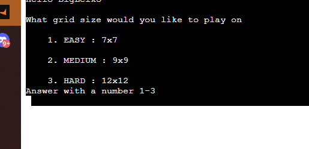
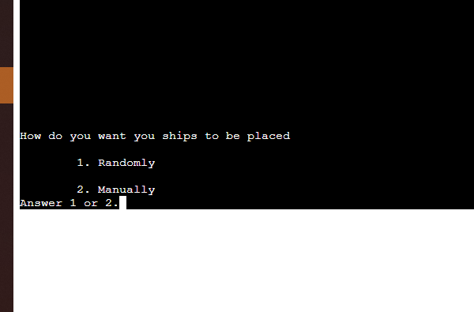
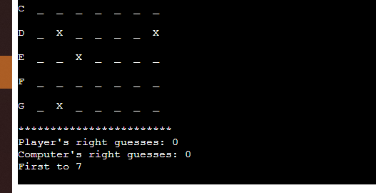
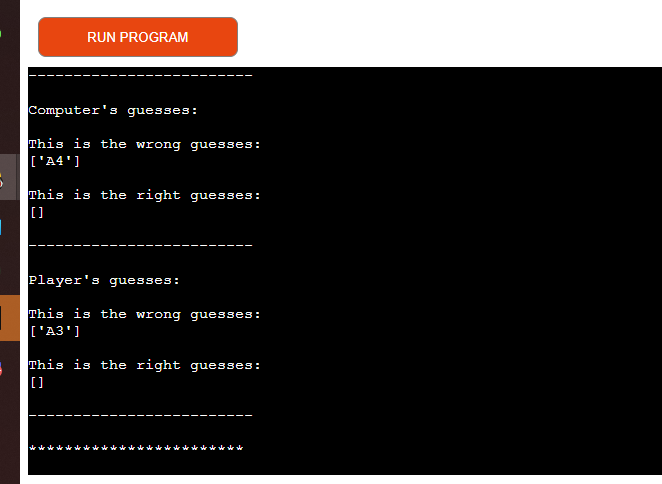

# Battle Ships

This is an application built for you who want to challenge yourself with a game against the computer, it is very simple to use. Choose your settings for the map, place your ships and start guessing. You can choose between 3 different difficulties where the hardest can take you a while to finish, click [Battle-Ships](https://battle-ships-dexter-7296ea4452b6.herokuapp.com/) to try it out.

## Features:
---
- Difficulties - The user can choose between Easy, Medium and Hard.
    - Map-size - The size of the map increases in symbiose with the difficulty
    - Amount of ships - As well as the map, the amount of ships able to place increases.

    

- Place ship modes - User can choose to place out ships either randomly or manually

    

	

- Show stats - Throughout the game, updated statistics of the game are printed.

    

- Show guesses - All the right and wrong guesses are saved in the list and are displayed in order to ease any confusion if the coordinates have already been guessed.

    

## Features left to implement
---
- Ships taking up more space - One feature I would like to implement is longer ships instead of them being 1:1 coordinates. This would make it more like the real board game.

## Testing
---
- Validation - I have validated the code to make sure that no typos, errors, white spaces or blank lines interfere with the game meanwhile I tested out the code so that the changes in the code did not affect the experience negative while playing.

- Playing - I have played the game numerous times in order to come up with possible errors occurring while putting in the wrong input as a player, this have helped handling those errors in the code to answer the user once wrong input is provided.

- Other testing - I tried to create the game in different ways, with ships able to be longer than one coordinate making it possible for the user to choose direction and so on. From that I have worked my way to a less complicated version of the game since it both provides a more user friendly experience with a smaller amount of possible errors and with some tips from my Mentor, it is less time consuming which was important due to the intense time window for the submission. With this said I have tested creating the game in different ways to come up with the best strategy both when it comes to the process of creating and experience while playing.

## Unfixed bugs:
- In general, throughout the game you won't experience any bugs except how the information provided by the game is displayed which is not affecting how the game works.

## Deployment
- First, navigate to the heroku dashboard.
- Then create new app
- Once I created the app, navigate to settings in the nav bar.
- I did not need to add any more settings then buildpacks Python and Node.js
    - If you have sensitive information, you need to add config Vars.
- Then I chose deployment method (GitHub)
- After I searched for the repository containing the project and clicked connect
- Then I got a choice whether to deploy manually or automatic, I chose manually.
    - Difference is that automatic will update every time you push your code to github.

- The live link can be found here - [Battle-Ships](https://battle-ships-dexter-7296ea4452b6.herokuapp.com/)

## Credits
- Mentor:
    - Structure - Showed me a good structure to follow through out the code
    - Strategies - How to properly use functions and how to reuse them efficiently

- Youtube:
    - https://www.youtube.com/watch?v=brICUKrzVR0
    - https://www.youtube.com/watch?v=i_ZEaE5vfE0
- Other usefull links:
    - https://peps.python.org/pep-0008/#indentation
    - https://docs.python.org/3/library/exceptions.html
    - https://stackoverflow.com/questions/41317905/adding-sequential-values-in-list-to-target-value
